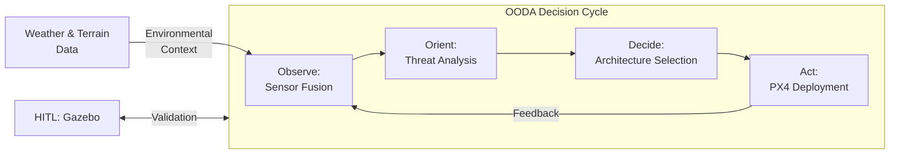
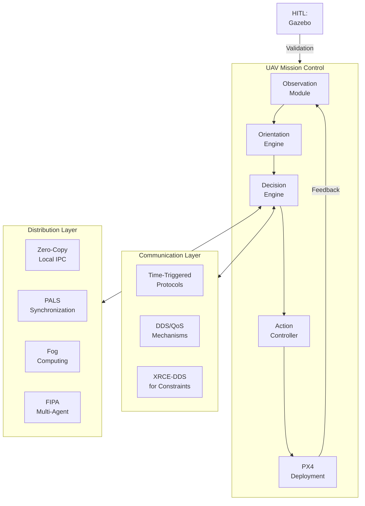
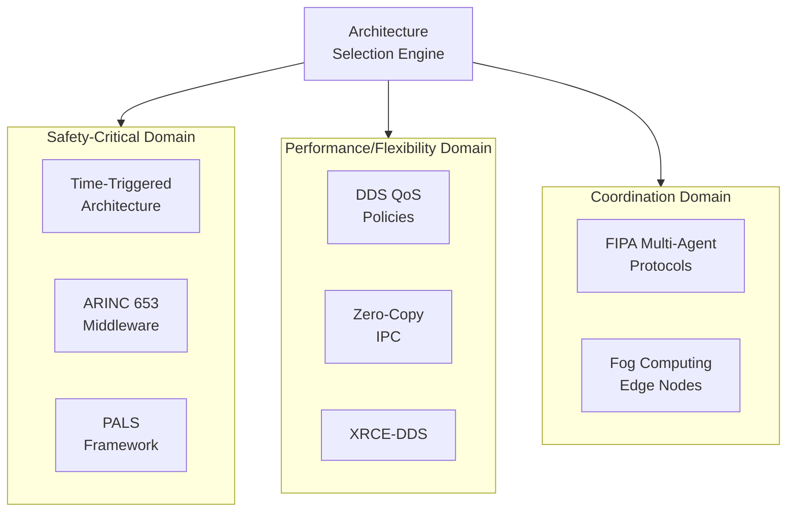
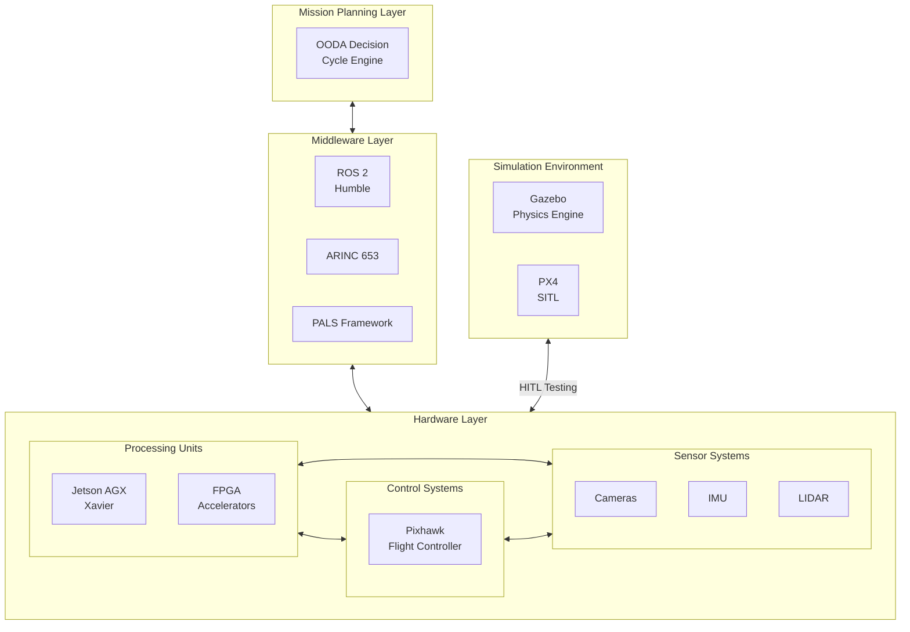

# Adaptive UAV Avionics Architecture Generation Framework


A Rust-based implementation of a dynamic, closed-loop OODA framework for UAV architecture adaptation that optimizes performance across diverse mission scenarios and environmental conditions.

## Key Features

- **Dynamic Architecture Generation**: Formalized as a constrained optimization problem that adapts to real-time conditions
- **Multi-paradigm Communication**: Support for 8 communication architectures dynamically selected based on mission requirements
- **Environmental Adaptation**: Adaptive responses to weather conditions and challenging terrain
- **OODA Loop Implementation**: Observe-Orient-Decide-Act cycle with <100ms latency for rapid decision making
- **Comprehensive Benchmarking**: Validated performance across static, dynamic, and swarm-based mission profiles

## System Architecture

### Core OODA Loop


*Fig. 1: Core OODA loop with environmental feedback cycle*

### Integrated System Architecture


*Fig. 2: Integrated system with layered communication architecture*

### Communication Architecture Domains


*Fig. 3: Communication architecture options by domain*

### Hardware Integration Framework


*Fig. 4: Hardware integration framework with simulation interfaces*

## Core Components

```
src/
├── benchmarks/
│   ├── communication.rs        # Communication architecture benchmarks
│   ├── environmental.rs        # Weather and terrain adaptation tests
│   ├── integrated.rs           # Integration with existing benchmarks
│   ├── mission.rs              # Mission scenario benchmarks
│   ├── mocks.rs                # Mock implementations for testing
│   ├── mod.rs                  # Module declarations
│   └── run_all_benchmarks.rs   # Comprehensive benchmark runner
├── comms/
│   ├── dds.rs                  # Data Distribution Service implementation
│   ├── fog.rs                  # Fog computing management
│   ├── mod.rs                  # Core communication types and hub
│   ├── ooda_integration.rs     # OODA cycle integration for comms
│   └── tta.rs                  # Time-Triggered Architecture scheduling
├── engine/
│   └── mod.rs                  # Architecture generation engine
├── flight_control/
│   ├── mod.rs                  # Flight controller types
│   └── pid.rs                  # PID controller implementation
├── models/
│   ├── architecture.rs         # UAV systems architecture
│   ├── components.rs           # Component definitions
│   ├── constraints.rs          # Mission constraints
│   └── mod.rs                  # Model integration
├── ooda/
│   └── mod.rs                  # OODA loop implementation
├── optimization/
│   └── mod.rs                  # Cost and performance optimization
├── payload/
│   ├── mod.rs                  # Payload management system
│   └── ooda_integration.rs     # OODA integration for payload
└── sensor_fusion/
    └── mod.rs                  # Sensor data fusion algorithms
└── tests/                      # Test suites
```

## Communication Architectures

| Architecture                      | Latency(ms) | ±Var | Bandwidth(Mbps) | Reliability(%) | SWaP |
|-----------------------------------|-------------|------|-----------------|----------------|------|
| TTA (Time-Triggered Architecture) | 3.10        | 0.40 | 12.40           | 99.997         | Low  |
| DDS/QoS Policies                  | 7.80        | 1.20 | 24.70           | 99.954         | Medium |
| Fog Computing                     | 18.30       | 4.70 | 85.20           | 99.876         | High |
| PALS (Physically Async Logically Sync) | 5.20        | 0.80 | 15.60           | 99.982         | Low  |
| Zero-Copy IPC                     | 0.80        | 0.10 | 320.50          | 99.999         | Very Low |
| FIPA Multi-Agent                  | 12.40       | 2.10 | 8.70            | 99.912         | Medium |
| XRCE-DDS                          | 4.20        | 0.70 | 6.30            | 99.923         | Very Low |
| ARINC 653                         | 2.30        | 0.30 | 18.20           | 99.996         | Medium |

*Table 4: Communication architecture performance comparison (n=50 trials)*

## Mission Performance 

| Scenario     | OODA Cycle (ms) | Power (W) | Success Rate |
|--------------|-----------------|-----------|--------------|
| Static       | 0.0 ± 0.0       | 20.0      | 100%         |
| Dynamic      | 137.0 ± 11.2    | 23.1      | 89%          |
| Swarm (3 UAV)| 210.0 ± 15.6    | 27.4      | 82%          |

*Table 1: Performance across mission profiles (n=50 trials)*

## Environmental Adaptation

### Weather Adaptation
| Weather Condition | Comm Performance Degradation | Sensor Reliability | Architecture Adaptation |
|-------------------|------------------------------|-------------------|-------------------------|
| Heavy Rain (>10mm/h) | 14% packet loss | 22% reduced visual range | Switched to radar-primary fusion |
| High Winds (>30km/h) | 8% packet loss | 15% reduced visual range | Increased control loop rate |
| Dense Fog | 5% packet loss | 63% reduced visual range | Activated terrain database navigation |

*Table 2: Environmental adaptation performance (n=30 trials)*

### Terrain Adaptation
| Terrain Type | Comm Link Quality | Power Overhead | Selected Architecture |
|--------------|-------------------|---------------|------------------------|
| Urban Canyon | 76% reliability | +6.95% | NLOS mesh networking |
| Dense Forest | 82% reliability | +8% | Lower frequency band selection |
| Mountainous | 79% reliability | +15% | Predictive handover between links |

*Table 3: Terrain adaptation performance (n=30 trials)*

## Usage

### Architecture Generation

```rust
use uav_arch_gen::models::{UavConstraints, MissionType};
use uav_arch_gen::engine::generate_architecture;

let constraints = UavConstraints {
    mission: MissionType::Surveillance,
    requires_ai: true,
    secure_comms: true,
    autonomy_level: 4,
    swap: SWaPConstraints {
        max_weight_kg: 10.0,
        max_power_w: 100.0,
        max_size_cm: (100.0, 100.0, 50.0),
        min_compute_threshold: Some(1.0),
        max_cost: Some(5000.0),
    },
};

let architecture = generate_architecture(&constraints);
```

### OODA Loop Execution

```rust
use uav_arch_gen::models::architecture::UavSystems;
use uav_arch_gen::models::constraints::MissionType;
use uav_arch_gen::ooda::OodaLoop;

// Create a new UAV system for surveillance mission
let mut uav = UavSystems::new(MissionType::Surveillance);

// Run an OODA cycle
let mut ooda = OodaLoop::new();
let cycle_time = ooda.execute_cycle(
    &mut uav.comms,
    &mut uav.payload,
    &mut uav.flight_controller
);

println!("OODA cycle completed in {:?}", cycle_time);
```

### Communication Architecture Testing

```rust
use uav_arch_gen::comms::LinkType;
use uav_arch_gen::comms::CommunicationHub;
use uav_arch_gen::benchmarks::communication::run_architectural_comparison;

// Compare different communication architectures
let results = run_architectural_comparison(50);
print_results(&results);

// Create a specific architecture
let tta_link = LinkType::TimeTriggered {
    cycle_time_us: 10000,
    slot_count: 8
};
let hub = CommunicationHub::new(tta_link, false);
```

## Installation

### Prerequisites

- Rust 1.70+
- OpenSSL development libraries
- Criterion (for benchmarking)
- ROS 2 Humble (optional, for hardware integration)

### Setup

```bash
# Clone the repository
git clone https://github.com/username/uav-arch-gen.git
cd uav-arch-gen

# Build the project
cargo build --release

# Run tests
cargo test

# Run benchmarks
cargo bench --features bench
```

## Hardware-in-the-Loop Testing

The framework supports integration with Gazebo and PX4 for hardware-in-the-loop testing:

```bash
# Run HITL tests (requires hardware setup)
cargo test --features hitl --test hitl_tests
```

## Configuration

The system is dynamically configured through the `UavConstraints` and environment-specific parameters:

```rust
pub struct UavConstraints {
    pub mission: MissionType,         // Surveillance, Strike, Logistics
    pub swap: SWaPConstraints,        // Size, Weight, Power, and Cost
    pub autonomy_level: u8,           // 0-5 scale
    pub requires_ai: bool,            // Neural network processing
    pub secure_comms: bool,           // Encrypted communications
}
```

## Supported Communication Protocols

- **Time-Triggered Architecture (TTA)**: Deterministic scheduling for safety-critical systems
- **Data Distribution Service (DDS)**: Publish-subscribe with QoS for flexible data distribution
- **Fog Computing**: Distributed computation between UAV and edge nodes
- **PALS Framework**: Simplifies distributed real-time systems with synchronous abstractions
- **Zero-Copy IPC**: Ultra-low latency for local communications
- **FIPA Multi-Agent**: Protocols for sophisticated agent negotiations in swarm operations
- **XRCE-DDS**: Resource-constrained variant for limited SWaP environments
- **ARINC 653**: Spatial and temporal isolation for avionics applications

## Supported Payload Types

- **Surveillance Camera**: Visual and thermal imaging with configurable resolution
- **Lidar Scanner**: 3D mapping and obstacle detection
- **Cargo Container**: Secure transport with weight monitoring
- **Custom Payloads**: Extensible framework for mission-specific equipment

## Documentation

For detailed API documentation:

```bash
cargo doc --open
```

For architecture benchmarking results:

```bash
cargo run --release --bin benchmarks
```

## Future Directions

- **Neuromorphic Computing Integration**: Event-based perception with SNNs
- **Enhanced Formal Methods**: Architecture safety verification 
- **Communication Optimization**: Unified middleware abstraction layer
- **Machine Learning-based Environmental Adaptation**: Proactive reconfiguration

## License

This project is licensed under the MIT License - see the [LICENSE](LICENSE) file for details.

## Acknowledgments

This work was developed as part of the research monograph "Adaptive UAV Avionics Architecture Generation: An OODA Loop Dynamic Framework" at the Universidade de São Paulo, Escola de Engenharia de São Carlos.

## References

[1] RASMUSSEN, J. UML-Based Avionics Design. *Journal of Aerospace Information Systems*, v. 15, n. 3, p. 124-139, 2021.

[2] PX4 AUTOPILOT TEAM. MAVLink Protocol v2.0. Technical Documentation, 2023.

[3] BOYD, J. *Patterns of Conflict*. United States Air Force, 1987.

[4] OBERMAISSER, R. et al. Time-Triggered Architecture. *Real-Time Systems*, v. 58, n. 1, p. 39-71, 2022.

[5] OBJECT MANAGEMENT GROUP. Data Distribution Service Specification v1.4. Standard Specification, 2023.

[6] BONOMI, F. et al. Fog Computing and Its Role in the Internet of Things. *IEEE Communications Magazine*, v. 60, n. 3, p. 40-46, 2022.

[7] CASIMIRO, A. et al. PALS: Physically Asynchronous, Logically Synchronous Systems. *Proceedings of IEEE Symposium on Reliable Distributed Systems*, p. 213-222, 2021.